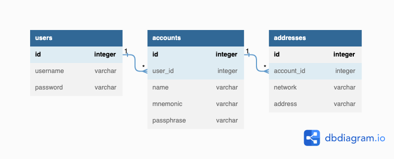

# Crypto API

## Description
REST API for generating valid cryptocurrency addresses and displaying them.

For now supported cryptocurrencies are: `[BTC, ETH, BCH, DASH, DOGE, ZEC, RVN]`

## Decisions made

1. Metamask and other software wallets keep private keys on the device.
I don't think it's the best decision for software wallet to use centralized storage as a database for storing this type of sensitive data.

2. Under REST API I assume that we have some centralized storage and should have some user database.
So under this assumption I decided to implement JWT authorization so that we can generate multiple accounts and addresses for the same user.

### API framework

I decided to use FastAPI as I have most experience with it, and it natively supports asynchronous operation, which can increase one time active requests drastically.

### Database Schema

I decided to use PostgreSQL as I have most experience with it. Was created 3 tables for users, accounts and addresses.

Schema as follows:



### Encryption

All sensitive data such as passwords, mnemonics, passphrases are stored safely inside the db.

1. Passwords: hashed using bcrypt. So do not store anything raw and can not be reverted.
2. Mnemonics and passphrases: encrypted using the AES256 algorithm. 
Key must be generated beforehand and separated into parts using Shamir scheme.
This will help us to reduce a risk of single person knowing a key will dump the database and get access to all the wallets.
3. JWT token subscription: uses HS256 algorithm. Key must be rotated once in a while.
4. SSL certificates (self-signed and self-managed for development): used to ensure it will be difficult for a hacker to perform the MIM attack on end users.

## How to run

Prerequisites:

1. Docker installed

It's as simple as just running next command on your PC:

```bash
docker compose up -d --build
```

To see the docs and test the API you can visit https://localhost:8080/docs
